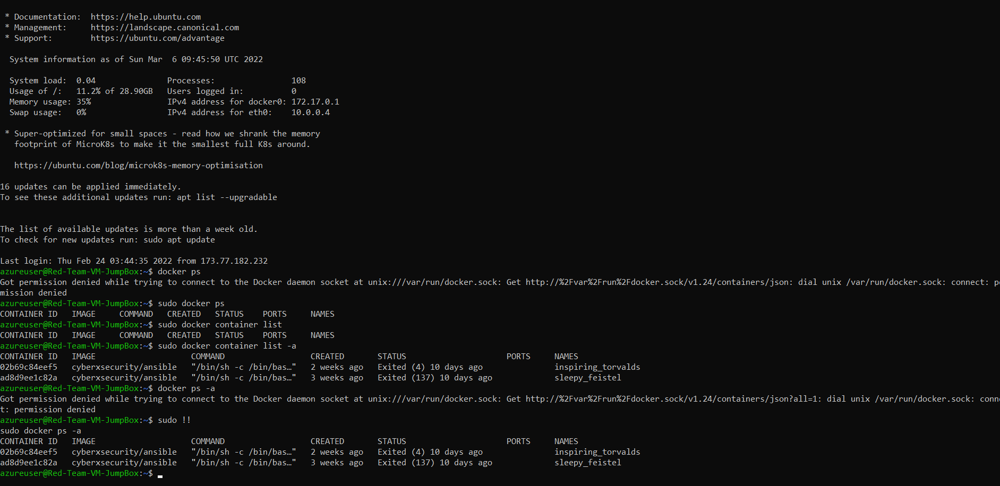

# Project_ELK_Stack
Cloud Security, Docker, Ansible

## Automated ELK Stack Deployment

The files in this repository were used to configure the network depicted below.

These files have been tested and used to generate a live ELK deployment on Azure. They can be used to either recreate the entire deployment pictured above. 
Alternatively, select portions of the __YAML__ file may be used to install only certain pieces of it, such as Filebeat.

  - _TODO: Enter the playbook file.   __install-elk.yml__

This document contains the following details:
- Description of the Topology
- Access Policies
- ELK Configuration
  - Beats in Use
  - Machines Being Monitored
- How to Use the Ansible Build

### Description of the Topology

The main purpose of this network is to expose a load-balanced and monitored instance of DVWA, the D*mn Vulnerable Web Application.

Load balancing ensures that the application will be highly __EFFECTIVE__, in addition to restricting __TRAFFIC ACCESS__ to the network.
- _TODO: 
- What aspect of security do load balancers protect? 
 _A load balancer offers a health probe function to regularly check all the machines behind the load balancer. 
Load balancers can reduce the load on your web servers and optimize traffic for a better user experience. 
Load balancer prevents unwanted and unauthorized traffic from reaching the application. 
They do this by rerouting traffic to other servers in the group if one should fail.
 _
- What is the advantage of a jump box?_
_A jump box is a secure computer that all admins first connect to before launching any administrative task or use as an origination point to connect to other servers or untrusted environments. The purpose of an SSH jump server is to be the only gateway for access to your infrastructure reducing the size of any potential attack surface. 
Having a dedicated SSH access point also makes it easier to have an aggregated audit log of all SSH connections.
_

Integrating an ELK server allows users to easily monitor the vulnerable VMs for changes to the __CONFIGURATION FILES__ and system __FILES__.
- _TODO: What does Filebeat watch for?__
Filebeat monitors the log files or locations that you specify, collects log events and centralized log data.
_
- _TODO: What does Metricbeat record?__
Metricbeat takes the metrics and statistics that it collects and ships them to the output that you specify, Metricbeat is a lightweight agent that can be installed on target servers to periodically collect metric data from your target servers, this could be operating system metrics such as CPU or memory or container or data related to services running on the server.
_

The configuration details of each machine may be found below.
_Note: Use the [Markdown Table Generator](http://www.tablesgenerator.com/markdown_tables) to add/remove values from the table_.
-----------------------------------------------------------------------------------------------------
| **Name**   | **Function** | **Public IP Address** | **Private IP Address** | **Operating System** |
|------------|--------------|-----------------------|------------------------|----------------------|
| JumpBox    | Gateway      | 20.119.57.56          | 10.0.0.4               | Linux                |
| VM-Web1    | Web Server   | N/A                   | 10.0.0.5               | Linux                |
| VM-Web2    | Web Server   | N/A                   | 10.0.0.6               | Linux                |
| ELK-Server | Server       | 52.165.31.198         | 10.1.0.4               | Linux                |

### Access Policies

The machines on the internal network are not exposed to the public Internet. 

Only the __JUMPBOX__ machine can accept connections from the Internet. Access to this machine is only allowed from the following IP addresses:
- _TODO: Add whitelisted IP addresses_ _**My local computer public IP address**: 40.76.19.139_

Machines within the network can only be accessed by __my perssonal Laptop_ and __JUMPBOX__.
- _TODO: Which machine did you allow to access your ELK VM? __JUMPBOX PROVISIONER.
- 
What was its IP address? __my public ip address : 20.119.57.56 via SSH port 22._

A summary of the access policies in place can be found in the table below.

| **Name**   | **Public IP Accessible** | **Allowed IP Address**                |
|------------|--------------------------|---------------------------------------|
| JumpBox    |            YES           | user computer using ssh  20.119.57.56 |
| VM-Web1    |            NO            |      jumpbox using ssh 10.0.0.5       |
| VM-Web2    |            NO            |      jumpbox using ssh 10.0.0.6       |
| ELK-Server |            NO            |      jumpbox using ssh 10.1.0.4       |

### Elk Configuration

Ansible was used to automate configuration of the ELK machine. No configuration was performed manually, which is advantageous because...
- _TODO: What is the main advantage of automating configuration with Ansible?
**Ansible allows to automate the creation of multiple servers using a single playbook. This is save time and eliminates repeated actions and syntax errors in the deployment process.** _

The playbook implements the following tasks:
- _TODO: In 3-5 bullets, explain the steps of the ELK installation play. E.g., install Docker; download image; etc._
**
-   Defines the hosts
-   Installs docker.io
-   Installs python3-pip and docker python module
-   Increases memory of the container (_sysctl -w vm.max_map_count=262144_)
-   Download and launch a docker web container : ELK Docker container
**

The following screenshot displays the result of running `docker ps` after successfully configuring the ELK instance.

### Target Machines & Beats

This ELK server is configured to monitor the following machines:
- _TODO: List the IP addresses of the machines you are monitoring_
| **Machine Name** | **IP Address** |
|------------------|----------------|
| VM-Web1          |    10.0.0.5    |
| VM-Web2          |    10.0.0.6    |

We have installed the following Beats on these machines:
- _TODO: Specify which Beats you successfully installed_
- **
- Filebeat
- Metricbeat
- **

These Beats allow us to collect the following information from each machine:
- _TODO: In 1-2 sentences, explain what kind of data each beat collects, and provide 1 example of what you expect to see. E.g., `Winlogbeat` collects Windows logs, which we use to track user logon events, etc._
**- 
    Filebeat collects logs files from specified files, tools and webservers, and MySQL database
    Metricbeat collects metrics and statistics such as system, memory and network. IT looks out for any information in the file system which has been manipulated.
**

### Using the Playbook
In order to use the playbook, you will need to have an Ansible control node already configured. Assuming you have such a control node provisioned: 

SSH into the control node and follow the steps below:
- Copy the __install-elk.yml__ file to __/etc/ansible/___.
- Update the __configuration__ file to include __the ELK server IP address_
- Update the __ansible host___ file to include __the ELK server IP address and the webserver IP address_
- Run the playbook, and navigate to __Jumpbox__ and run __ansible all -m ping
  __http://52.165.31.198:5601/app/kibana__ to check that the installation worked as expected. (52.165.31.198 is the elk-public-IP)

_TODO: Answer the following questions to fill in the blanks:_
- _Which file is the playbook? 
-     **install-elk.yml, filebeat-playbook.yml, metricbeat-playbook.yml **
-     
- _Where do you copy it?_
-       the files are copied in **/etc/ansible** directory.
-       
- _Which file do you update to make Ansible run the playbook on a specific machine? 
-       **From /etc/ansible, ansible.cfg file must be updated to include the remote_user.** 
-       **And also hosts file must be updated to include the private IP address of VM-Web1, VM-Web2, and ELK-Server.**
-       
- _How do I specify which machine to install the ELK server on versus which to install Filebeat on?_
-       In the /etc/ansible/hosts file, 
-       [webserver]-       
        10.0.0.5 ansible_python_interpreter=/usr/bin/python3
        10.0.0.6 ansible_python_interpreter=/usr/bin/python3

        [elk]
        10.1.0.4 ansible_python_interpreter=/usr/bin/python3

- _Which URL do you navigate to in order to check that the ELK server is running?
      __http://52.165.31.198:5601/app/kibana
      
_As a **Bonus**, provide the specific commands the user will need to run to download the playbook, update the files, etc._
(connect to jumpbox)
    ssh -i id_rsa azureuser@20.119.57.56
    sudo docker ps -a
    sudo docker start <_container ID_> && sudo docker attach <_container ID_>
    cd /etc/ansible/
    ls
    nano hosts
    nano ansible.cfg
    ansible all -m ping
    ansible-playbook install-elk.yml
    
(connect elk server)    
    ssh azureuser@10.1.0.4    
    curl -L -o https://artifacts.elestic.co/downloads/beats/filebeat/filebeat-7.6.1-amd64.deb
    sudo docker run -it _docker name_/ansible /bin/bash
    nano filebeat-config.yml
    filebeat-playbook.yml
    ansible-playbook filebeat-playbook.yml
    
root@:/etc/ansible# nano metricbeat-config.yml
root@:/etc/ansible# nano metricbeat-playbook.yml
root@:/etc/ansible# ansible-playbook metricbeat-playbook.yml

Diagram : diagram
